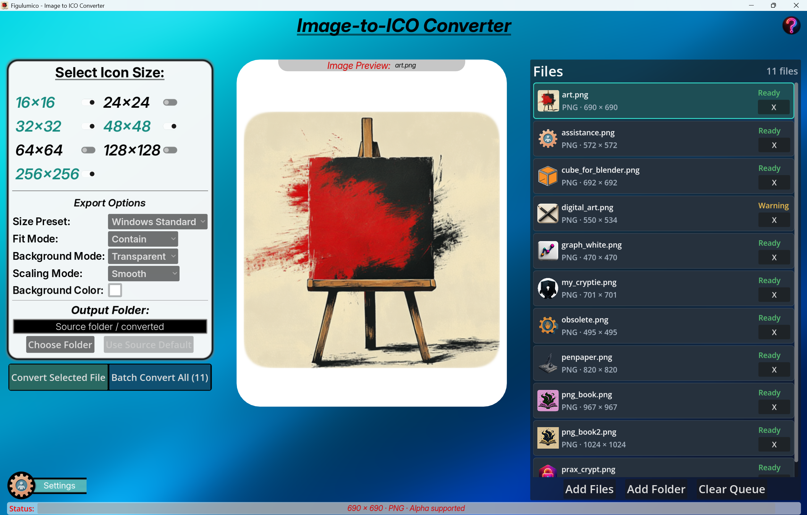
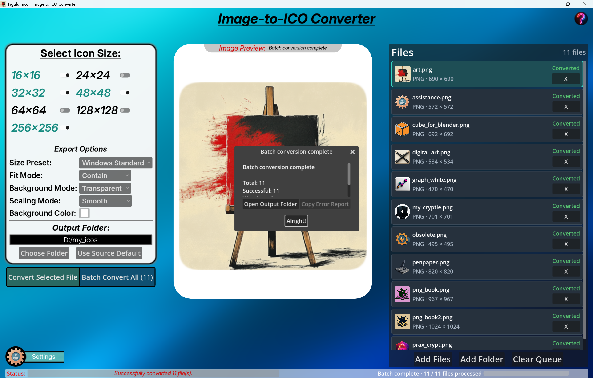

# Figulumico — Image to ICO Converter

Figulumico is a local Windows desktop application for converting PNG, JPG/JPEG, and BMP images into professional multi-size `.ico` files.

It is designed for indie game developers, pixel artists, UI/UX designers, modders, and anyone who needs clean Windows icon files without relying on online converters or complex image-editing software.

Images are processed entirely on your device. No cloud uploads. No telemetry. No user accounts.  
---

## Screenshots

### Main Window

## Features

* PNG, JPG, JPEG, and BMP import  
* Single-file and batch ICO conversion  
* Drag and drop for files and folders  
* Non-recursive folder import  
* File queue with thumbnails, metadata, and conversion status  
* Source-image preview with transparency 
* Multi-size ICO export  
* Icon size presets and custom size selection  
* Image fit and scaling controls  
* Transparent or solid-color backgrounds for Contain mode  
* Default and custom output folders  
* Optional output-folder prompt before conversion  
* Collision handling for existing ICO files  
* Persistent local settings  
* Batch progress display and result summary  
* Copyable batch error reports  
* About dialog and contextual tooltips  
* Local Windows desktop workflow

---

## Supported Icon Sizes

| Size | Available |
| ----: | :---: |
| 16 × 16 | Yes |
| 24 × 24 | Yes |
| 32 × 32 | Yes |
| 48 × 48 | Yes |
| 64 × 64 | Yes |
| 128 × 128 | Yes |
| 256 × 256 | Yes |

---

## Download and Installation

1. Download the latest Windows release ZIP.
2. Extract the ZIP file to a folder of your choice.
3. Start `Figulumico.exe`.

No Python installation, Godot editor installation, or external image-processing library is required.

---

## System Requirements

| Component | Requirement |
|---|---|
| Operating System | Windows 10 or Windows 11, 64-bit |
| Processor | x86_64 CPU |
| Memory | 2 GB RAM minimum |
| Graphics | Direct3D 12 compatible GPU, Feature Level 12_0 |
| Storage | Approximately 250 MB of available disk space |
| Architecture | Windows x64 |

## Quick Start

1. Add images using **Add Files**, **Add Folder**, or drag files or folders into the application.
2. Select one or more target icon sizes.
3. Adjust export options if needed.
4. Select a queue item and click **Convert Selected File** to convert one image.

   Or click **Batch Convert All (N)** to convert every file currently in the queue.

5. Find the generated ICO files in the selected output folder.

By default, ICO files are written to:

`<source folder>/converted/`

Example:

`D:/Artwork/player.png`

`→ D:/Artwork/converted/player.ico`  
---

## Supported Input Formats

| Format | Supported | Transparency |
| ----- | :---: | ----- |
| PNG | Yes | Supported and preserved |
| JPG | Yes | No source alpha channel |
| JPEG | Yes | No source alpha channel |
| BMP | Yes | Transparency support depends on the source file |

---

## Icon Size Presets

| Preset | Included Sizes |
| ----- | ----- |
| Windows Standard | 16, 32, 48, 256 |
| Small | 16, 24, 32, 48 |
| High Resolution | 64, 128, 256 |
| Custom | User-selected sizes |

Changing an individual icon-size checkbox automatically switches the active preset to Custom.

---

## Export Options

### Fit Modes

| Mode | Behavior | Recommended For |
| ----- | ----- | ----- |
| Contain | Keeps the complete source image visible. Empty canvas areas use the selected background mode. | Logos, pixel art, illustrations, transparent artwork |
| Center Crop | Fills the complete square icon area and crops excess edges from the center. | Photos, portraits, full-frame artwork |
| Stretch | Resizes the source image to fill the square icon area. Image proportions may be distorted. | Special cases and intentionally stylized graphics |

### Scaling Modes

| Mode | Behavior | Recommended For |
| ----- | ----- | ----- |
| Smooth | Uses high-quality smooth scaling. | Photos, illustrations, soft-edged logos, rendered artwork |
| Pixel Perfect | Uses nearest-neighbor scaling to preserve hard pixel edges. | Pixel art, sprites, retro UI, hard-edged graphics |

### Background Modes

| Mode | Behavior |
| ----- | ----- |
| Transparent | Empty areas created by Contain mode remain transparent. |
| Solid Color | Empty areas created by Contain mode use the selected background color. |

Background mode is relevant primarily when using Contain. Center Crop and Stretch fill the complete icon area with the source image.  
---

## Output Folders

### Source Default

By default, Figulumico creates a `converted` folder next to each source image.

Example:

`D:/Artwork/player.png`

`→ D:/Artwork/converted/player.ico`

### Custom Output Folder

Choose a custom output folder to export one or more ICO files into the same location.

### Ask Before Converting

When enabled in Settings, Figulumico asks for an output folder before every single-file or batch conversion.

The folder selected in this dialog is used only for that conversion and does not overwrite the saved default output folder.

---

## Existing File Handling

When an ICO file with the same target filename already exists, choose one of these strategies in Settings:

| Strategy | Behavior |
| ----- | ----- |
| Auto Number | Creates a numbered filename such as `icon_01.ico`. Existing files are preserved. |
| Overwrite | Replaces the existing ICO file with the newly generated file. |
| Skip | Does not create a new file and marks the conversion result as skipped. |

Auto Number is the default and recommended option.

---

## Batch Conversion

Batch conversion processes every file currently in the queue.

During a batch run, Figulumico provides:

* Per-file queue status updates  
* Batch progress display  
* Success, warning, skipped, and failed result counts  
* A batch results dialog  
* Output-folder access  
* A copyable error report

A failed source image does not stop the remaining batch files from being processed.

---

## Settings

Figulumico stores settings locally in:

`user://settings.json`

On Windows, the default location is usually:

`%APPDATA%\Godot\app_userdata\Figulumico\settings.json`

Saved settings include:

* Default output folder  
* Last used output folder  
* Ask-for-output-folder preference  
* Default icon-size preset  
* Selected icon sizes  
* Fit mode  
* Scaling mode  
* Background mode and color  
* Collision strategy

If the settings file is missing or invalid, Figulumico starts safely with default settings.

---

## Keyboard Shortcuts

| Shortcut | Action  |
| ----- | ----- |
| `Esc` | Closes an active dialog or exits the application when no batch conversion is running. |
| `Alt + F4` | Closes the application through the standard Windows shortcut. |

---

## Privacy

Figulumico processes images locally.

* No cloud processing
* No image uploads
* No telemetry
  ---

## Limitations

Version `v1.0.0` does not include:

* SVG import  
* WebP import  
* Background removal 
* Recursive folder import  
* Conversion history  
* ICO inspection tools  
  ---

## Building from Source

### Requirements

* Godot Engine 4.6  
* Windows desktop environment for the official v1.0.0 target build

### Steps

* Clone  the repository.  
* Start Godot Engine 4.6.  
* In the Godot Project Manager, click Import.  
* Select the repository folder  
* Click Import  to open the project in the Godot editor.
  ---

## Credits

Figulumico is created and maintained by Sven Knaak.

Built with Godot Engine 4.6.

Third-party license information is available in
[THIRD_PARTY_NOTICES.md](THIRD_PARTY_NOTICES.md).

---

## License

Figulumico is released under the [MIT License](LICENSE.md).
